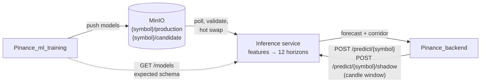

# Pinance ML Inference

Model-serving service of **Pinance**, a real-time crypto price-forecasting system. It takes a window of candles from the caller, computes the features, runs the LightGBM models loaded from object storage and returns a 12-step return forecast (5 to 60 minutes ahead) with a 10 %/90 % corridor. A second, *candidate* model can be served in parallel, so a new model can be judged on live traffic before it replaces the current one.

The modelling work, validation and results live in [`Pinance_ml_training`](https://github.com/GKatzer/Pinance_ml_training). This repository is the part that runs in production, and it is built around one question: **how do you make sure the model sees in serving exactly the features it was trained on?**

> **Not a trading signal and not financial advice.** A 5-minute crypto forecast is close to the limit of predictability. This service exists so that such forecasts can be produced and measured carefully.

## What this project demonstrates

- **Feature parity enforced, not assumed.** A model is rejected at load time unless its feature list equals what the serving code computes, and the names stored *inside every LightGBM file* match too. LightGBM itself ignores column names at prediction time (shown by a [short check](docs/examples/lightgbm_names_check.py): a renamed column gives the identical output). [Design decisions 3 to 6](docs/design-decisions.md)
- **Pinned against the trainer by real data.** The schema fingerprint is checked against the feature lists and hashes of four models exported by the training pipeline (BTCUSDT: 93 features, `38b98fc7516d`; the other three: 94 features, `f72fb5b8ba97`). [`tests/test_schema_parity.py`](tests/test_schema_parity.py)
- **Replayable predictions.** `predict()` is a pure function of the request, so a forecast the backend missed can be requested again later and comes out the same. [Decision 1](docs/design-decisions.md#1-predict-is-a-pure-function-of-its-arguments)
- **Failures surface when a model is loaded, not on every request.** A bad push keeps the previous model and records the reason in `GET /models`. [Decision 3](docs/design-decisions.md#3-the-model-carries-its-own-schema-and-the-service-refuses-a-mismatch)
- **Runnable offline.** A [demo script](docs/offline-demo.md) trains toy models, replaces MinIO with a local directory and starts the real service, so every behaviour above can be seen through HTTP: hot swap, a rejected push that leaves the old model serving, a corridor dropped on a schema mismatch.
- **Tested without infrastructure:** 92 tests pass in about 3 seconds with the database and MinIO faked, including HTTP-level tests of the 404/422 mapping. See [Tests and quality](#tests-and-quality) for what is *not* covered.

## Contents

[Idea](#idea) · [Features](#features) · [How it works](#how-it-works) · [Quick start](#quick-start) · [Try it offline](#try-it-offline) · [Usage](#usage) · [Configuration](#configuration) · [API](#api) · [Repository layout](#repository-layout) · [Tests and quality](#tests-and-quality) · [Deployment](#deployment) · [Limitations](#limitations) · [Related repositories](#related-repositories) · [License](#license)

Further reading in `docs/`:

| File | What is there |
|---|---|
| [docs/architecture.md](docs/architecture.md) | component diagram, slots and files in object storage, one poll cycle and one prediction step by step |
| [docs/design-decisions.md](docs/design-decisions.md) | ten decisions with the reasoning, tests that pin them, and what was not done |
| [docs/offline-demo.md](docs/offline-demo.md) | toy models + fake MinIO: how to run the real service offline, captured requests and responses, hot swap and rejection transcripts, timing on toy models |
| [docs/api.md](docs/api.md) | every endpoint: request rules, response fields, errors, how to read `GET /models` |
| [docs/deployment.md](docs/deployment.md) | what the systemd unit does, start-up requirements, rolling out a new feature schema |

## Idea

A model trained offline is useful in production only if serving feeds it the same numbers the training saw. Forecasting models are especially easy to break silently: a booster accepts any matrix of the right width and returns a number. So the serving side has to answer three questions itself:

1. **Are these the same features?** Compare the model's recorded feature list, its internal feature names and a short fingerprint against what the serving code computes, and refuse otherwise.
2. **Can a new model be tried safely?** Keep two slots per symbol, `production` and `candidate`, served by the same code, so the candidate's behaviour on live data is what promotion will actually produce.
3. **Can any moment be reproduced?** Make prediction a function of the request only.

The origin of this design is a real bug: a cumulative volume indicator (`obv`) was computed over years of history in training and over a 150-candle window in serving, and the two values differed (about 73 % apart in the training repository's synthetic regression test, not measured on real candles; described there, which also reports that offline metrics barely moved, because offline metrics cannot see it). It was replaced by the windowed `obv_roc_36`, and the checks above were added so that the next skew of this kind is caught at load time.

## Features

**Prediction**
- 12 horizons (5 to 60 minutes) per request from 12 independent LightGBM models per slot; returns a log-return and a price for each. [`predict.py`](src/pinance_ml_inference/predict.py)
- Optional corridor: quantile models at 0.1 and 0.9 give `r_q10` / `r_q90` and `price_q10` / `price_q90`. Crossed quantiles are sorted so the band is always ordered. [Decision 8](docs/design-decisions.md#8-quantile-crossing-is-repaired-not-hidden)
- 93 features for BTCUSDT; 94 for other symbols, which add the BTC log-return as a cross-asset input (so the request must carry the BTCUSDT window too).
- Window validation: at least 150 candles (below that most features are undefined), BTC window for other symbols, last candle equal to `as_of_ts`. A bad window is a 422 with a message, not a wrong number.

**Model management**
- Models are polled from MinIO (default every 600 s) and swapped in memory without a restart; the version pair `(model_version, quantile_model_version)` decides whether anything is downloaded. [`model_registry.py`](src/pinance_ml_inference/model_registry.py)
- Two slots per symbol. `POST /predict/{symbol}/shadow` serves the candidate; an empty candidate slot answers 404.
- A corridor with a different schema than the point model is ignored while the point forecast keeps serving. [Decision 5](docs/design-decisions.md#5-a-corridor-trained-on-another-schema-is-ignored-not-fatal)

**Schema protection**
- Feature list in `metadata.json` vs vendored code; `schema_version` label vs its own list; booster-embedded names and their order vs the list. [`models.py`](src/pinance_ml_inference/models.py)
- `GET /models` exposes what is loaded, whether it matches, why a push was rejected, and the fingerprint the service expects per symbol. The training side reads it before promoting a model.

**Monitoring hooks**
- Each response carries `schema_version`, `feature_count`, `inference_ms`, the training-time `feature_baseline` and a `feature_snapshot` of six features for the predicted row. This service does not compute drift; the fields exist so a consumer can.

## How it works



For one request: normalise `as_of_ts`, look up the slot's models (404 if none), validate the window, compute features with the vendored code, take the last row, predict 12 horizons (with the corridor when loaded), return. Details with sequence diagrams are in [docs/architecture.md](docs/architecture.md).

### Key design decisions

| Decision | Reason (full text in [design-decisions](docs/design-decisions.md)) |
|---|---|
| Pure `predict`, window supplied by the caller | replay and backfill of missed forecasts; no hidden state |
| Vendored feature code with a pinned commit ([`LOCK.md`](src/pinance_ml_inference/vendor/LOCK.md)) | the serving host clones only this repository |
| Validate at poll time, keep the previous model on failure | a bad push must not become a stream of 500 errors |
| Check names inside booster files | metadata and files are pushed separately and can disagree; LightGBM does not check names |
| Corridor ignored, not fatal, on a schema mismatch | point and corridor are trained and pushed independently |
| Polling every 10 minutes | models change on a retraining schedule; a failed poll leaves the old models serving |

## Quick start

Requirements: Python 3.12 or newer. Running the **tests** needs nothing else; running the **service** needs a MinIO with models pushed by the training pipeline and a database with a `candles` table, neither of which is part of this repository.

```bash
git clone https://github.com/GKatzer/Pinance_ml_inference.git
cd Pinance_ml_inference
uv venv --python 3.12 && source .venv/bin/activate
uv pip install -r requirements.txt     # versions pinned to match the training environment
cp .env.example .env                   # fill in the database and MinIO values
python -m pytest
```

Output on a clean environment (Python 3.12.3, pytest 9.1.1, dummy environment variables, nothing contacted):

```
collected 92 items
…
======================== 92 passed, 1 warning in 3.42s ========================
```

The tests import the config module, which reads the variables from `.env.example`, so they need those names to be set; dummy values are enough.

Start the service (requires reachable MinIO and database, not run in the environment where this README was written):

```bash
uvicorn pinance_ml_inference.api:app --app-dir src --port 8001
```

## Try it offline

No MinIO, database or real models needed: the demo script builds toy models (a random walk, 20 trees per booster) into a local directory that stands in for the bucket, and starts the real service on top of it. Full walkthrough with captured outputs: [docs/offline-demo.md](docs/offline-demo.md).

```bash
python docs/examples/toy_demo.py build-models toy_store --version toy-1
python docs/examples/toy_demo.py make-request candles.json
python docs/examples/toy_demo.py serve toy_store &            # 127.0.0.1:8011
curl -s -X POST 127.0.0.1:8011/predict/ETHUSDT -H 'Content-Type: application/json' -d @candles.json
```

```
BTCUSDT/production: version=toy-1 variant=ok features=93 files=37
ETHUSDT/production: version=toy-1 variant=ok features=94 files=37
wrote candles.json: as_of_ts=2026-01-11T09:55:00+00:00, 200 candles for BTCUSDT, ETHUSDT
```

The response is a real `/predict` answer from the service (`feature_count: 94`, 12 horizons, corridor included) whose *numbers* mean nothing, because the models are toys. The only substitution is the object store, which is a directory instead of MinIO.

## Usage

Health and loaded models (requires a running service; the response shape is in [docs/api.md](docs/api.md)):

```bash
curl -s http://127.0.0.1:8001/health
curl -s http://127.0.0.1:8001/models
```

A forecast needs a body with 150+ candles, so it is easiest to send one from a file or a script (`candles.json` here is a file you produce from your own candle source):

```bash
curl -s -X POST http://127.0.0.1:8001/predict/BTCUSDT \
     -H 'Content-Type: application/json' -d @candles.json
curl -s -X POST http://127.0.0.1:8001/predict/BTCUSDT/shadow \
     -H 'Content-Type: application/json' -d @candles.json
```

For a quick manual check that reads the latest candles from the database instead of the request, there is a CLI (requires database and MinIO):

```bash
python scripts/predict_cli.py BTCUSDT            # production slot
python scripts/predict_cli.py BTCUSDT --shadow   # candidate slot
```

The experiment behind decision 4 can be run anywhere the requirements are installed:

```bash
python docs/examples/lightgbm_names_check.py
```

```
booster.feature_name(): ['a', 'b', 'c']
own names      : -0.16358501101230444
renamed column : -0.16358501101230444
order swapped  : 0.4349148217212994
```

Responses from the offline demo (toy models) are in [docs/offline-demo.md](docs/offline-demo.md); no response from a production deployment is included, since the service is not exposed publicly.

## Configuration

Read in [`config.py`](src/pinance_ml_inference/config.py); template in [`.env.example`](.env.example).

| Variable | Required | Default | Meaning |
|---|---|---|---|
| `DATABASE_URL` | yes | none | SQLAlchemy URL of a read-only connection to the database with the `candles` table; used for the symbol list and `predict_cli.py` |
| `MINIO_ENDPOINT` | yes | none | `host:port` of MinIO |
| `MINIO_ACCESS_KEY`, `MINIO_SECRET_KEY` | yes | none | credentials for reading the models bucket |
| `MINIO_SECURE` | no | `false` | use HTTPS to MinIO (`true`/`false`) |
| `MINIO_MODELS_BUCKET` | no | `pinance-models` | bucket with `{symbol}/{slot}/…` objects |
| `MODEL_POLL_INTERVAL_SECONDS` | no | `600` | how often to look for new model versions |

Constants in the same file: `HORIZONS` 1 to 12, `CANDLE_INTERVAL_MINUTES` 5, `MIN_WARMUP_CANDLES` 150, `FETCH_CANDLES` 250 (CLI only).

## API

| Endpoint | Description |
|---|---|
| `GET /health` | liveness |
| `GET /models` | loaded versions, schema match, corridor status and last load error per symbol and slot; expected schema fingerprint per symbol |
| `POST /predict/{symbol}` | forecast from the production slot |
| `POST /predict/{symbol}/shadow` | the same request against the candidate slot |

Status codes: 404 when no model is loaded for that slot, 422 for a window that is too short, misaligned with `as_of_ts` or malformed. Full request rules, response fields and the reading guide for `/models`: [docs/api.md](docs/api.md).

## Repository layout

```
src/pinance_ml_inference/
  api.py             FastAPI app, request models, error mapping, polling thread
  predict.py         pure prediction function
  model_registry.py  thread-safe registry, MinIO polling, hot swap, /models status
  models.py          ModelSet assembly and all schema checks (no I/O)
  minio_client.py    object-store access with short timeouts
  db.py              symbol list and the CLI's candle query
  config.py          environment variables and constants
  vendor/            pinned copy of the training feature code (+ LOCK.md)
scripts/predict_cli.py     manual smoke test against the database
deploy/                    systemd unit
docs/                      architecture, design decisions, API, deployment, offline demo
docs/examples/             toy_demo.py (toy models + fake MinIO), the LightGBM names check, captured outputs
tests/                     92 tests, plus the fixture with training schema vectors
```

## Tests and quality

92 tests, all passing (`python -m pytest`, about 3 s). The database and MinIO are faked or monkeypatched.

| File | Tests | Covers |
|---|---|---|
| `test_predict.py` | 21 | window validation, `as_of_ts` alignment, sorting, response fields, slots, quantile fields and crossed quantiles |
| `test_models.py` | 18 | schema checks, corridor status, booster-name diff for renamed and reordered features, fingerprint |
| `test_model_registry.py` | 14 | hot swap, no re-download on an unchanged version, quantile-only update, rejected push keeps the previous set, `/models` status |
| `test_minio_client.py` | 6 | missing object means empty slot, other errors propagate, key naming |
| `test_vendor_features.py` | 4 | exact 93 columns, `btc_ret` only with BTC candles, no look-ahead, warm-up NaNs |
| `test_schema_parity.py` | 8 | hash and column lists against four real training exports |
| `test_api_models.py` | 3 | `/models` wiring, also when the database is down |
| `test_api_predict.py` | 18 | the `/predict` and `/shadow` routes through FastAPI: 200, 404 (no model, takes precedence over a bad window), 422 (short window, missing or short BTC window, `as_of_ts` mismatch, malformed body), upper-casing, naive timestamps as UTC, and start-up surviving a failed initial poll |

Not covered, and said plainly: the real MinIO client against a real server, the polling thread's timing, a real uvicorn process, and actual model files produced by the trainer (tests build small boosters or stubs). The HTTP tests use FastAPI's in-process `TestClient` with a stubbed registry. No CI result is claimed.

## Deployment

One uvicorn process under systemd, bound to the node's private-network address only, with no public port. Models are held in memory, so no writable path is needed. Details, start-up requirements and the procedure for rolling out a new feature schema: [docs/deployment.md](docs/deployment.md). The unit was not started in the environment where this documentation was written.

## Limitations

- **Candles are trusted.** The service checks length, order and alignment but cannot tell whether the candles are right, or closed.
- **One feature schema at a time.** After a feature change, models on the old schema are rejected by the new code, so promotion across a schema change is a manual, coordinated step ([docs/deployment.md](docs/deployment.md#rolling-out-a-new-feature-schema)).
- **No tests with model files from the real training pipeline**, and none against a real MinIO server; the HTTP tests run in-process with a stubbed model registry.
- **No authentication.** Protection is network-level: the service is bound to a private address.
- **No drift computation here.** The response has the baseline and snapshot fields; nothing in this repository compares them.
- **Single process.** The in-process poller and in-memory models assume one uvicorn process; several workers would each poll and hold their own copy.
- **Staleness up to one poll interval** when a new model is pushed.
- **Real models are not included.** Running the service for real needs models from the training pipeline and candles from the backend; the offline demo substitutes toy models and a directory for MinIO, so it shows behaviour, not forecast quality or production latency.
- Pinned dependency versions (pandas 3.0.3, numpy 2.5.1, lightgbm 4.7.0, ta 0.11.0) must match the training environment: `ta` indicators can differ between versions.

## Related repositories

```
Binance WebSocket ─► backend (FastAPI, TimescaleDB, Redis) ──► predictions, live shadow metrics
                           │ candles                                   ▲
                           ▼                                           │ /admin/metrics
   Pinance_ml_training:  features ─► walk-forward ─► LightGBM ─► MinIO (candidate slot) ─► inference service
   (training)                                              │                    (shadow-serves it)
                                                           └─ promote_if_better ─► MinIO (production slot)
```

This repository is the "inference service" box: it loads what training pushes to MinIO, answers the backend's prediction requests, and tells training whether a pushed model matches the serving schema.

| Repository | Role |
|---|---|
| [Pinance_ml_training](https://github.com/GKatzer/Pinance_ml_training) | features, validation, experiments, retraining, promotion |
| **Pinance_ml_inference** (this) | model-serving service; polls MinIO, serves production and shadow candidate |
| [Pinance_backend](https://github.com/GKatzer/Pinance_backend) | candle ingestion, API, prediction store, live metrics |
| [Pinance_frontend](https://github.com/GKatzer/Pinance_frontend) | web UI: live forecast, model performance, MLOps, methodology |

## License

MIT, see [`LICENSE`](LICENSE).
Author: George Denisov · [GitHub](https://github.com/GKatzer) · [Telegram](https://t.me/denisov_george)
