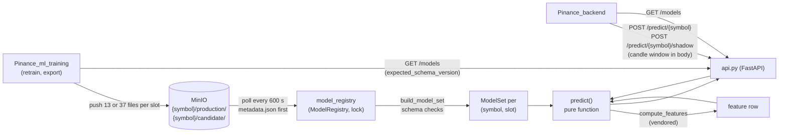
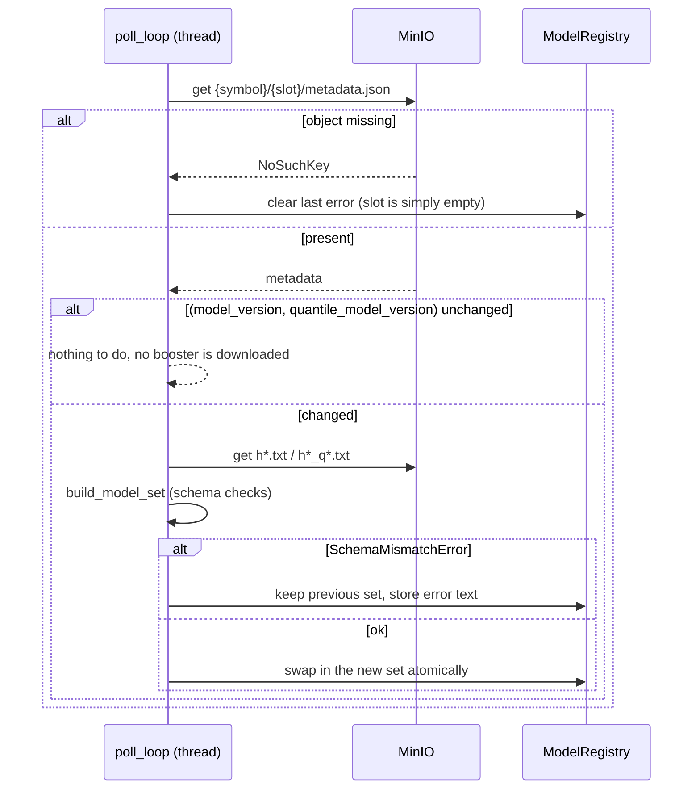

# Architecture

This service sits between the backend (which owns candles and forecasts) and the object store (which holds models pushed by the training side). It owns no data of its own: everything it knows is either in the request or in memory loaded from MinIO.

## Components

| Module | Role |
|---|---|
| [`api.py`](../src/pinance_ml_inference/api.py) | HTTP layer: request models, UTC normalisation, mapping domain errors to 404/422, background polling thread started in `lifespan` |
| [`predict.py`](../src/pinance_ml_inference/predict.py) | `predict(symbol, as_of_ts, candles, btc_candles, slot=...)`: validation, features, 12 horizons, quantile sorting, response assembly |
| [`model_registry.py`](../src/pinance_ml_inference/model_registry.py) | `ModelRegistry` (thread-safe dict of `ModelSet`s plus last load error per slot), `fetch_and_register`, `models_status`, polling loop, expected feature list per symbol |
| [`models.py`](../src/pinance_ml_inference/models.py) | `build_model_set` and the schema logic: fingerprint, corridor status, booster-name verification. No I/O |
| [`minio_client.py`](../src/pinance_ml_inference/minio_client.py) | object-store access with short timeouts and no retries; "not found" means "slot empty" |
| [`vendor/features.py`](../src/pinance_ml_inference/vendor/features.py) | pinned copy of the training feature pipeline |
| [`db.py`](../src/pinance_ml_inference/db.py) | symbol list and the CLI's candle query; not used on the prediction path |

## Slots and files

For every symbol there are two slots, `production` and `candidate`. A slot is a set of objects under `{symbol}/{slot}/`:

| Object | Content |
|---|---|
| `metadata.json` | `feature_columns`, `schema_version`, `model_version`, `horizons`, `quantile_levels`, `quantile_model_version`, `quantile_schema_version`, optional `quantile_horizons`, `feature_baseline`, `source_commit` |
| `h{1..12}.txt` | LightGBM text dump of the median model for horizon *h* (also the point forecast) |
| `h{1..12}_q0.1.txt`, `h{1..12}_q0.9.txt` | the corridor tails, present only when the metadata lists `quantile_levels` and their schema matches |

The key list is derived from the metadata by one function (`booster_keys_from_metadata`) that is used both to decide what to download and what to assemble, so the two cannot disagree.

## One poll cycle

- The first poll runs inside `lifespan` and blocks start-up, so a restarted service does not answer 404 for up to ten minutes. A bad MinIO endpoint cannot stall start-up for long: connect timeout 2 s, read timeout 5 s, no retries. If the initial poll fails (for example the database is down), the error is logged and the app still starts; the poll loop retries immediately and then every interval.
- The version key is the pair `(model_version, quantile_model_version)`, because the point models and the corridor are trained and pushed independently; a corridor-only update to an already loaded slot must still be noticed ([`test_fetch_and_register_reloads_on_quantile_only_version_change`](../tests/test_model_registry.py)).
- One failing `(symbol, slot)` does not stop the cycle for the others (`test_poll_once_continues_after_one_symbol_fails`).

## One prediction

1. `api.py` takes `candles[SYMBOL]` (and `candles["BTCUSDT"]` for any other symbol), builds DataFrames and normalises `as_of_ts` to a UTC timestamp. A naive timestamp is treated as UTC.
2. `predict()` first asks the registry for the slot's `ModelSet` (cheap: a missing candidate answers before any computation), then checks window length (≥ 150), BTC window length for non-BTC symbols, and that the last candle's `ts` equals `as_of_ts`.
3. `compute_features` runs on the whole window; the last row is the model input, reordered to the model's `feature_columns`.
4. For each of the 12 horizons the median (and, when a corridor is loaded, the two tails) is predicted. With a corridor the three raw outputs are sorted, because independently trained quantile models can cross; prices are `close * exp(r)`.
5. The response carries versions, `feature_count`, `feature_baseline` (passed through from the metadata) and a `feature_snapshot` of six features for the row that was predicted.
